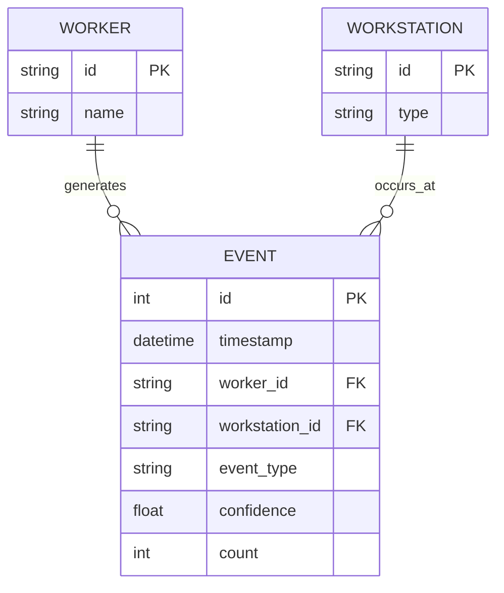
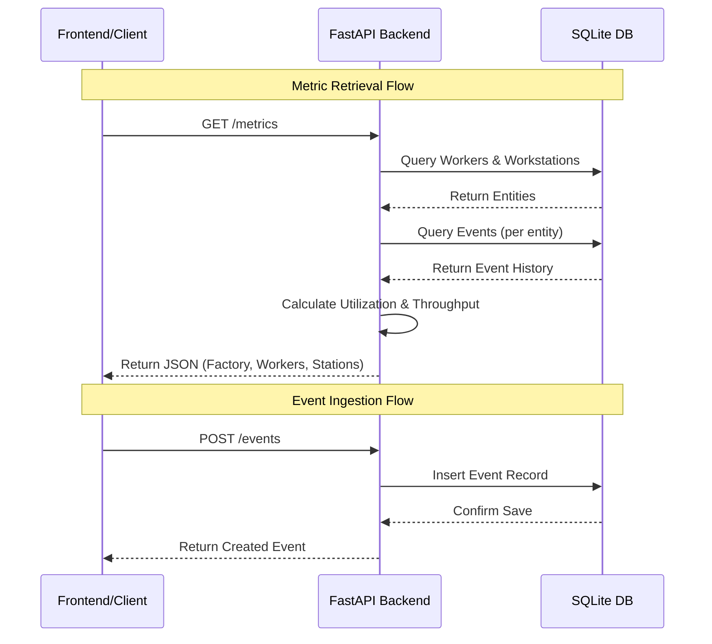

# AI-Powered Worker Productivity Dashboard

## Architecture Overview

Overview of the system architecture:

1. **Edge Devices (CCTV)**: Capture video and run CV models (out of scope, simulated).
2. **Backend (FastAPI)**:
    * **Ingestion API**: Receives JSON events from Edge devices.
    * **Database (SQLite)**: Stores `Worker`, `Workstation`, and `Event` data.
    * **Metrics Engine**: Computes productivity metrics on-demand based on stored events.
3. **Frontend (React + Vite)**:
    * Displays real-time dashboard.
    * Fetches aggregated metrics from Backend.

## Running the Application

### Prerequisites

* Docker & Docker Compose

### Steps

1. Clone the repository.
2. Run:

    ```bash
    docker-compose up --build
    ```

3. Access the Dashboard at `http://localhost:3000`.
4. Access the API Docs at `http://localhost:8000/docs`.

## Technical Assessment Answers

### 1. Handling Edge Cases

* **Intermittent Connectivity**: Edge devices should buffer events locally and retry sending them when connection is restored. The backend should handle bulk uploads.
* **Duplicate Events**: Implement a unique `event_id` (UUID) from the edge. The database should check for existence of `event_id` before insertion to ensure idempotency.
* **Out-of-order Timestamps**: The system stores raw events with their generation timestamp. Metrics calculation sorts events by timestamp, so insertion order doesn't affect correctness.

### 2. Model Lifecycle

* **Versioning**: Include `model_version` in the event payload. Store it in the DB. This allows comparing performance across versions.
* **Drift Detection**: Monitor the distribution of `confidence` scores and `event_types` over time. Significant deviation (e.g., sudden drop in confidence) triggers an alert.
* **Retraining**: Use a "Human-in-the-loop" feedback system where uncertain events (low confidence) are flagged for manual review. Corrected labels become the training set for the next version.

### 3. Scaling

* **5 Cameras**: Current architecture (Monolithic FastAPI + SQLite) works fine.
* **100+ Cameras**:
  * **Database**: Migrate to PostgreSQL/TimescaleDB for better time-series performance.
  * **Backend**: Run multiple worker replicas behind a Load Balancer (Nginx/AWS ALB).
  * **Message Queue**: Introduce Kafka or RabbitMQ between Edge and Backend to decouple ingestion from processing and handle bursts.
* **Multi-site**:
  * **Edge**: Edge processing covers most compute.
  * **Cloud**: Centralized aggregation. Each site buffers data and syncs to a central cloud data warehouse (Snowflake/BigQuery) for global reporting.

## Assumptions

* **Active Time**: Calculated as the summation of time intervals starting with a 'working' event until the next event. Gaps > 1 hour are ignored to account for shifts ending.
* **Utilization**: (Active Time / Total Time Range) * 100.

## System Visualizations

### 1. System Architecture

```mermaid
graph TD
    User[User Browser] -->|HTTP/80| Frontend[Frontend Container<br>(React + Vite)]
    Frontend -->|HTTP/JSON| Backend[Backend Container<br>(FastAPI)]
    Backend -->|SQLAlchemy| DB[(SQLite Database<br>factory.db)]
    subgraph Docker Host
        Frontend
        Backend
        DB
    end
```

### 2. Database ER Diagram



### 3. API Flow Diagram



### 4. Event Processing Flow

```mermaid
flowchart TD
    A[Start: Calculate Metrics] --> B[Fetch All Workers]
    B --> C{For Each Worker}
    C -->|Next Worker| D[Fetch Events for Worker]
    D --> E[Sort Events by Timestamp]
    E --> F[Iterate Events (i, i+1)]
    F --> G[Calculate Duration (Next - Current)]
    G --> H{Event Type?}
    H -->|Working| I[Add to Active Time]
    H -->|Idle| J[Add to Idle Time]
    H -->|Product Count| K[Add to Total Units]
    I --> L[Next Event Pair]
    J --> L
    K --> L
    L --> M{End of Events?}
    M -->|No| F
    M -->|Yes| N[Calculate Utilization %]
    N --> O[Calculate Units/Hour]
    O --> C
    C -->|Done| P[Aggregate Factory Metrics]
    P --> Q[Return Dashboard Data]
```
